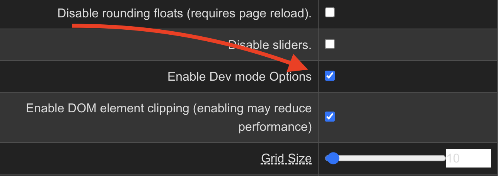
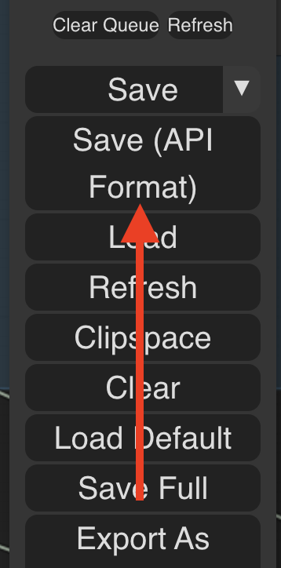

# Comfy API Simplified

This is a small python wrapper over the [ComfyUI](https://github.com/comfyanonymous/ComfyUI) API. It allows you to edit API-format ComfyUI workflows and queue them programmaticaly to the already running ComfyUI.

I use it to iterate over multiple prompts and key parameters of workflow and get hundreds of images overnight to cherrypick from.

## Limitations

Only Basic auth and no auth (for local server) are supported.

## Install

`pip3 install comfy_api_simplified`

## Use prerequisits

### Prepare workflow

You would like to have your node titles unique. Usually both positive and negative prompts have title "CLIP Text Encode (Prompt)", you would like to at least give them different names in case you would like to change it's parameters from python.

### Enable "dev options"

In ComfyUI settings, check "Enable Dev mode Options":


### Download your workflow in API-format



### Have running ComfyUI server

## Use

```python
from comfy_api_simplified import ComfyApiWrapper, ComfyWorkflowWrapper

# create api wrapper using your ComfyUI url (add user and password params if needed)
api = ComfyApiWrapper("http://127.0.0.1:8188/")

# create workflow wrapper using your downloaded in api format workflow
wf = ComfyWorkflowWrapper("workflow_api.json")

# change anything you like in your workflow
# the syntax is "Node Title", then "Input param name", then value
wf.set_node_param("Empty Latent Image", "batch_size", 2)
wf.set_node_param("negative", "text", "embedding:EasyNegative")

# queue your workflow for completion
results = api.queue_and_wait_images(wf, "Save Image")
for filename, image_data in results.items():
    with open(f"{filename}", "wb+") as f:
        f.write(image_data)

```

More examples:

- Queue prompt and get result images [example](examples/queue_with_different_params.py).

- Queue many prompts and do not wait for completion [example](examples/queue_and_wait_result.py).

- Send input image and then call i2i workflow [example](examples/send_input_image.py).

## Additional info

There are some other approaches to use Python with ComfyUI out there.

If you are looking to conver your workflows to backend server code, check out [ComfyUI-to-Python-Extension](https://github.com/pydn/ComfyUI-to-Python-Extension)

If you are looking to use running ComfyUI as backend, but declare workflow in Python imperatively, check out [ComfyScript](https://github.com/Chaoses-Ib/ComfyScript/tree/main).

## Known issues

If you try to run queue_and_wait_images in async method, it may give you an error since there is already async code inside.
As a workaround, you can use

```python
import nest_asyncio
nest_asyncio.apply()
```

for now.
